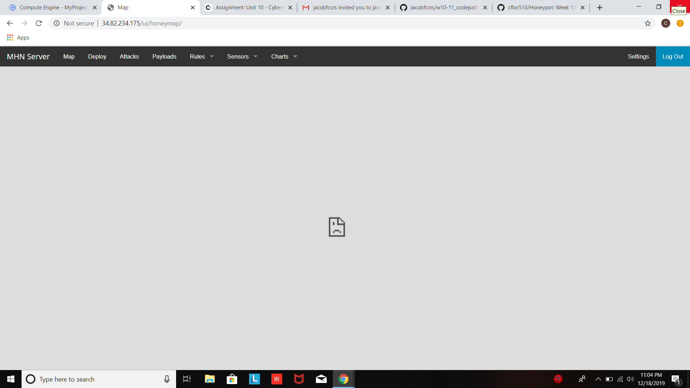
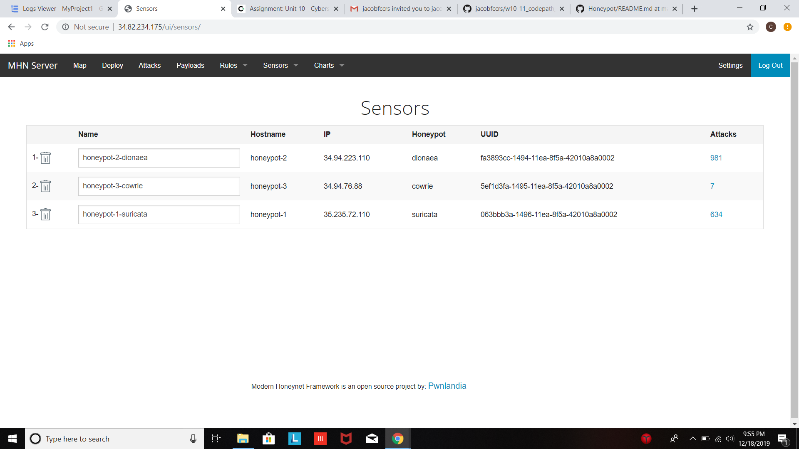
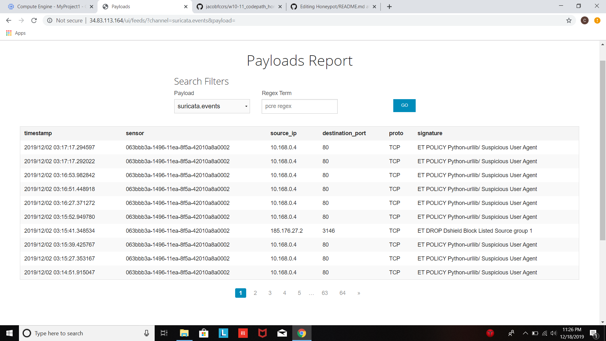

# Honeypot
Week 10-11 Codepath Assignment
Setting up a Honeypot to view intercepted attacks using MHN.

## Objective
To be able to deploy a Honeypot and review the attacks attempted on the Honeypot server.

## Honeypots deployed:
-Dionea

-Suricata

-Cowrie

## Hours Spent:
Around 5 or 6 hours

## Issues Encountered
For the most part the project went smoothly, I didnt have a lot of trouble setting everything up. The only thing I couldnt get running was the map. Everytime I would try to open it, it would say that the website took too long to and it timed out.

## Overview

These are all of the attacks i had running for 12/1-12/2. The dionea honey pot had the most attacks attempted on it.

These are some of the payloads that my honeypot recieved.

More information can be found in the json file in my repository.
